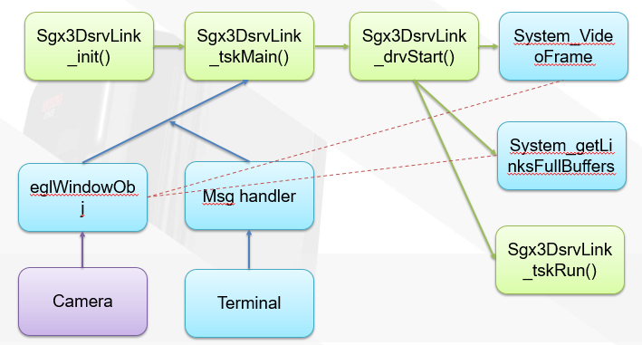

### Ti SDK SourceCode analysis (2)

#### 빠른 build를 위한 팁
* kernel이나 u-boot 및 sgx (rendering) 부를 수정하지 않은 코드는
> make -s -j depend 
  make -s -j

로 생성되는 apps.out파일 하나만 복사해서 집어넣으면 곧바로 실행이 가능하다. 그러나
지금부터 살펴볼 코드는 render와 opengl단을 보는 코드이기 때문에, 이들을 수정한 뒤에는 기존에 있던 vision_sdk폴더의 binaries 폴더를 완전히 삭제하고,
> make clean
  make linux
  make linux_install 
  make -s -j depend 
  make -s -j

를 전부 시행해주고, 생성된 `rootfs(ti_components에 있는)`을 `vision_sdk/binaries/apps/tda2px_evm_linux_all/hlos/linux/boot` 으로 압축해서 옮겨두고 `mksdboot.sh` 를 실행시켜 포팅해야한다.

* :bulb:grep -r "<검색할문자열>" ./ 로 검색해가면서 binary file 인 apps.out에서도 이게 검출되는지 확인해보면 굳이 보드에서 테스트 해보지 않아도 정상적으로 컴파일 되었는지 알 수 있다.

---

#### Surround View Ready


`<설치경로>/vision_sdk/apps/src/hlos/modules/sgx3Dsrv/sgx3DsrvLink_tsk.c`
* Surround View link 과정
 1. Sgx3DsrvLink_init() 함수내를 살펴보면, OSA_tskCreate에서 매개변수로 Sgx3DsrvLink_tskMain 콜백 함수를 사용한다.
 2. Sgx3DsrvLink_tskMain() 내부에 OSA_msgGetCmd(pMsg)로 터미널 명령을 받아 안으로 들임. SYSTEM_CMD_START라는 예약어(#define)과 값이 같다면
    - Sgx3DsrvLink_tskMain() 추가설명
    `Int32 Sgx3DsrvLink_tskMain(struct OSA_TskHndl *pTsk, OSA_MsgHndl *pMsg, UInt32 curState)`
    OSA로 부터 메세지 핸들러 *pMsg를 가져온다. 구조체 포인터변수 
    `Sgx3DsrvLink_Obj *pObj = (Sgx3DsrvLink_Obj *) pTsk->appData;` 선언후
    `status = Sgx3DsrvLink_drvCreate(pObj, OSA_msgGetPrm(pMsg));` 로 터미널 메세지 전송
 3. Sgx3DsrvLink_drvStart(pObj) 가 실행되면서 터미널에는 `Vps_printf(" SGX3DSRV Link: Start in progress !!!\n ");` 출력
</br>

* Surround View 이미지 생성 파라미터 부
Create
`<설치경로>/vision_sdk/apps/src/hlos/modules/sgx3Dsrv/sgx3DsrvLink_drv.c`
 `Int32 Sgx3DsrvLink_drvCreate(Sgx3DsrvLink_Obj *pObj, Sgx3DsrvLink_CreateParams *pPrm)`함수에 대한 설명
    1. memcpy(&pObj->createArgs, pPrm, sizeof(*pPrm)); 로 터미널 메세지를 받아주고
    2. OSA_assert(pPrm->numInQue <= SGX3DSRV_LINK_IPQID_MAXIPQ); 로 Queue 수량 체크
    3. 이하 for문에서 모든 Queue를 돌며 memcpy 해서 inQueInfo[inQue], inTskInfo[inQue] 두 개의 stack에 채워넣는 형태. (파라미터)
    4. OSA_assert함수를 통해 각종 데이터들을 받을 공간을 만들어준다.
    5. input Resoultion(inputRes)을 확인해서 Widht를 기준으로 2MP, MP 기준 FRAME WIDTH한계를 맞춰주고
    6. eglWindowObj라는 구조체 내부 변수를 통해 memory를 세팅해둔다.
    7. eglWindowObj의 가로세로 맞춰주고 나면 본격적으로 데이터를 넣어준다.
    8. pObj->tskInfo.queInfo[0].chInfo[0] 이제 여기에 모든 채널의 정보를 우리가 가져온 파라미터대로 초기화시켜주고
    9. System_LinkChInfo *pPrevChInfo 라는 변수가
  pPrevChInfo = &(pObj->inQueInfo[inputQId].chInfo[channelId]); 로 큐의 채널 정보를 가져올 수 있도록 초기화 되어있다.
    10. OSA_queCreate() 로 localinputQ 의 핸들을 가져온다.
</br>

* Surround View 이미지 생성 초기화 부
Create이후로 drvStart와 tskRun이 이어진다.
`<설치경로>/vision_sdk/apps/src/hlos/modules/sgx3Dsrv/sgx3DsrvLink_tsk.c`
`Sgx3DsrvLink_tskRun(pObj, pTsk, &pMsg, &done, &ackMsg);`함수에 대한 설명
    1. OSA에서 터미널 명령 받아오고, SYSTEM_CMD_NEW_DATA flag가 활성화 되어 있다면, 
    Sgx3DsrvLink_drvDoProcessFrames(pObj) 실행.
    2. 내부의 System_getLinksFullBuffers 함수를 지나 while문으로 진입하여 queue의 수량을 세고, queue에서부터 데이터를 얻는다. 
    `OSA_queGet( &(pObj->localInputQ[SGX3DSRV_LINK_IPQID_PALUT].queHandle), (Int32 *) &pSystemBufferPALUT, OSA_TIMEOUT_NONE);`
    3. pSystemBufferMultiview->chNum 에서 채널 id 따오고, 해당 채널로 데이터를 전송
    4. pSystemBufferMultiview->bufType==SYSTEM_BUFFER_TYPE_VIDEO_FRAME_CONTAINER 직후에 YUV plane을 사용하는 모습이 보임. 데이터 중 Y 채널에 대해서 정상적인 cropping이 작용할 것이고 UV채널들은 Y채널 직후에 데이터가 붙어서 나온다는 가정을 하고 있음.
    5. 데이터가 시작되는 좌표가 정상적으로 들어왔다면, `startX!=0 || startY!=0`
    offsetY 와 offsetUV를 정해주고
    6. pVideoCompositeFrame = (System_VideoFrameCompositeBuffer *)
                                        (pSystemBufferMultiview->payload);
    라고, System_VideoFrame전용 버퍼를 할당해 준다. 이 버퍼의 주소지를 videoCompositeFrame으로 정의
    7. videoCompositeFrame.bufAddr[0][0] ~ [1][3]까지 총 8개의 버퍼를 채워넣어 준다. 앞선 4개는 ([0][0]~[0][3]) Y채널, 뒤는 UV 채널로 할당해준 뒤에
    8. 실 데이터를 넣어주고, 이것을 편히 컨트롤하기 위해서 texYuv라는 변수에 각 채널 ID(또는 주소)를 전달해준다.
    ```
    texYuv[n] = System_eglGetTexYuv(&pObj->eglWindowObj, &texProp, videoCompositeFrame.bufAddr[0][n]); 또는
    texYuv[n] = System_eglWindowGetTexYuv(&pObj->eglWindowObj, &texProp, videoCompositeFrame.dmaFd[0][n]);
    ```
    9. 이때 System_eglWindowGetTexYuv 함수에 대해 알아보자면
    links_fw/src/hlos/system/system_gl_egl_util.c 에 있는 함수로,
    그 안에서 System_eglSetupYuvTexSurface 함수를 쓰는데 이때 dmaBufFd가 버퍼로 들어간다. 다시 해당 함수를 같은 파일내에서 찾아보면
    ```
    render_renderFrame(
                        &pObj->render3DSRVObj,
                        &pObj->eglWindowObj,
                        texYuv
                        );
    ```
    로 연결된다.
</br>

---

#### Rendering
`<설치경로>/vision_sdk/apps/src/hlos/modules/sgxRenderUtils/render.cpp`

* Render 함수
    <details>
    <summary><span style="color:green">📝Click to expand code "render_renderFrame"</span></summary>
    void render_renderFrame(render_state_t *pObj, System_EglWindowObj *pEglObj, GLuint *texYuv)
    {
        if(srv_render_to_file == true)
            set_coords_transition(0, srv_param_view1, srv_param_view2, srv_param_step);

    #ifndef _WIN32
        if(prev_time_usecs == 0)
        {
            gettimeofday(&tv, NULL);
            prev_time_usecs = 1000000 * tv.tv_sec + tv.tv_usec;
        }
    #endif

        shader_output_select = srv_param_select;
        glClear(GL_COLOR_BUFFER_BIT);
        {
            for(int i = 0; i < num_viewports; i++)
            {
                if(srv_viewports[i].animate == true)
                {
                    if( (animatengap[i] == false) && (pObj->enableContinousTransitions == false) )
                    {
                        /* stay here for gap number of frames;
                        *
                        */
                        step[i]++;
                        if(step[i] >= gap)
                        {
                            step[i] = 0;
                            animatengap[i] = true;
                        }
                    }
                    else
                    {

                                        if (pObj->enableContinousTransitions == true)
                                        {
                                            if (curvoid render_renderFrame(render_state_t *pObj, System_EglWindowObj *pEglObj, GLuint *texYuv)
    {
        if(srv_render_to_file == true)
            set_coords_transition(0, srv_param_view1, srv_param_view2, srv_param_step);

    #ifndef _WIN32
        if(prev_time_usecs == 0)
        {
            gettimeofday(&tv, NULL);
            prev_time_usecs = 1000000 * tv.tv_sec + tv.tv_usec;
        }
    #endif

        shader_output_select = srv_param_select;
        glClear(GL_COLOR_BUFFER_BIT);
        {
            for(int i = 0; i < num_viewports; i++)
            {
                if(srv_viewports[i].animate == true)
                {
                    if( (animatengap[i] == false) && (pObj->enableContinousTransitions == false) )
                    {
                        /* stay here for gap number of frames;
                        *
                        */
                        step[i]++;
                        if(step[i] >= gap)
                        {
                            step[i] = 0;
                            animatengap[i] = true;
                        }
                    }
                    elserent_index[i] == (num_srv_views-1))
                                            {
                                                increasingView = false;
                                            }

                                            if (current_index[i] == 2)
                                            {
                                                increasingView = true;
                                            }

                                            if (increasingView)
                                            {
                            next_index=(current_index[i] + 1)%(num_srv_views);
                            if (next_index == 0 || next_index == 1)
                            {
                                next_index = 2;
                            }
                                            }
                                            else
                                            {
                            next_index=(current_index[i] - 1)%(num_srv_views);
                            if (next_index == 0 || next_index == 1)
                            {
                                next_index = 2;
                            }
                                            }

                                            COORD_TRANSITION_SMOOTH(i, camx, next_index, step[i]);
                                            COORD_TRANSITION_SMOOTH(i, camy, next_index, step[i]);
                                            COORD_TRANSITION_SMOOTH(i, camz, next_index, step[i]);
                                            COORD_TRANSITION_SMOOTH(i, targetx, next_index, step[i]);
                                            COORD_TRANSITION_SMOOTH(i, targety, next_index, step[i]);
                                            COORD_TRANSITION_SMOOTH(i, targetz, next_index, step[i]);
                                            COORD_TRANSITION_SMOOTH(i, anglex, next_index, step[i]);
                                            COORD_TRANSITION_SMOOTH(i, angley, next_index, step[i]);
                                            COORD_TRANSITION_SMOOTH(i, anglez, next_index, step[i]);
                                            render_updateView();
                                            step[i]++;
                                            if(step[i] >= num_iterations)
                                            {
                            step[i] = 1;
                            animatengap[i] = false;
                            current_index[i] = next_index;
                            set_coords(0, current_index[i]);
                                            }
                                        }
                                        else
                                        {
                                            next_index=(current_index[i] + 1)%(num_srv_views);
                                            COORD_TRANSITION(i, camx, next_index, step[i]);
                                            COORD_TRANSITION(i, camy, next_index, step[i]);
                                            COORD_TRANSITION(i, camz, next_index, step[i]);
                                            COORD_TRANSITION(i, targetx, next_index, step[i]);
                                            COORD_TRANSITION(i, targety, next_index, step[i]);
                                            COORD_TRANSITION(i, targetz, next_index, step[i]);
                                            COORD_TRANSITION(i, anglex, next_index, step[i]);
                                            COORD_TRANSITION(i, angley, next_index, step[i]);
                                            COORD_TRANSITION(i, anglez, next_index, step[i]);
                                            render_updateView();
                                            step[i]++;
                                            if(step[i] >= num_iterations)
                                            {
                            step[i] = 0;
                            animatengap[i] = false;
                            current_index[i] = next_index;
                                            }
                                        }
                    }
                }
                else
                {
                                    if (pObj->enableContinousTransitions == true)
                                    {
                        step[i] = num_iterations;
                        current_index[i] = 2;
                                    }
                }

                glViewport(srv_viewports[i].x,
                        srv_viewports[i].y,
                        srv_viewports[i].width,
                        srv_viewports[i].height);

                if(srv_param_bowl)
                    srv_draw(pObj, texYuv, i);
                if(srv_param_car)
                    car_draw(i);
            }
            //boxes_draw((ObjectBox *)pObj->BoxLUT, (Pose3D_f *)pObj->BoxPose3D, texYuv);
        }

    #if ENABLE_SGX_RENDERED_PREVIEW
        // Draw the other panes
        {
            glViewport(0, 1080-(200+440*1),520,440);
            //screen1_draw_vbo(texYuv[0]);
        }
        {
            glViewport(0, 1080-(200+440*2),520,440);
            //screen1_draw_vbo(texYuv[1]);
        }
        {
            glViewport(520+880, 1080-(200+440*1),520,440);
            //screen1_draw_vbo(texYuv[2]);
        }
        {
            glViewport(520+880, 1080-(200+440*2),520,440);
            //screen1_draw_vbo(texYuv[3]);
        }
    #endif

    #ifndef _WIN32
        if(frame_count < 100)
        {
            frame_count++;
        }
        else
        {
            frame_count = 0;
            gettimeofday(&tv, NULL);
            cur_time_usecs = 1000000 * tv.tv_sec + tv.tv_usec;
            delta_usecs = cur_time_usecs - prev_time_usecs;
            fps = 100.0f/((float)delta_usecs/1000000.0f);
            prev_time_usecs = cur_time_usecs;
            RENDER_PRINT("%f fps\n", fps);
        }
    #endif
    }

    </details>

    texYuv는 4개 카메라에서 들어오는 모든 input에 대한 buffer와 파라미터들을 저장시켰던 변수(raw data형태는 아니고 pointer의 역할을 한다.) 이를 render_renderFrame에 넘겨주었다.
</br>

* Create render with OpenGL
    render_renderFrame 함수에서 다음과 같은 부분이 눈에 띈다.
    ```
    if(srv_param_bowl)
            srv_draw(pObj, texYuv, i);
    if(srv_param_car)
            car_draw(i);
    ```
    에서 src_draw가 surround view 이미지를 제작하고, car_draw가 미리 제작되어있는 car모형을 렌더링해서 화면에 보여주는 부분. 다시 srv_draw를 확인해보면

    <details>
    <summary><span style="color:green">📝Click to expand code "srv_draw"</span></summary>
    void srv_draw(render_state_t *pObj, GLuint *texYuv, int viewport_id)
    {
            int i;
            if(prevLUT != pObj->LUT3D || index_buffer_changed == true)
            {
                    prevLUT = pObj->LUT3D;
                    surroundview_init_vertices_vbo_wrap(pObj);
            }

            //First setup the program once
            glUseProgram(uiProgramObject);
            //then change the meshes and draw
            for(i = 0;i < QUADRANTS;i ++)
            {
                    onscreen_mesh_state_restore_program_textures_attribs(
                                    pObj, texYuv, (0+i)%4, (3+i)%4, viewport_id);
                    onscreen_mesh_state_restore_vbo(
                                    pObj, vboId[i*3], vboId[i*3+1], vboId[i*3+2]);
                    GL_CHECK(onscreen_mesh_state_restore_vbo);
                    glDrawElements(render_mode, index_buffers[active_index_buffer].length, GL_UNSIGNED_INT,  0);
                    GL_CHECK(glDrawElements);
            }
            glFlush();
    }
    </details>

:art:종합해보면
    1. 카메라 파라미터들과 이미지 정보를 버퍼에 저장 
    2. 핸들러 (texYuv와 같은)를 통해 opengl 로 넘기기
    3. opengl에서 랜더링
    4. opengl 밖으로 랜더링 결과를 보내는 것이 아닌, opengl program에서 window를 띄워 랜더링 결과 영상 현시
의 과정을 가진다.

따라서, 현재 rendering이 끝나 화면에 전시되어 있는 영상은 opengl 의 program 끝 단에서 송출되고 있는 영상이미지인 것으로, 이 영상을 취득하기 위해 opengl 함수중 하나인 glReadPixels를 사용했다.

```
        char *ScreenImageBuffer = (char*)malloc(1920*1080*4);
        FILE* OutputFile = fopen("imagesavetest", "wb");

        glReadPixels(0,0,1920,1080, GL_RGBA,GL_UNSIGNED_BYTE,ScreenImageBuffer);
        fwrite(ScreenImageBuffer,1920*1080*4,1,OutputFile);
        fclose(OutputFile);
        free(ScreenImageBuffer);
```

우선은 RGBA 색상으로 (헤더파일 없이) 출력을 파일로 저장해 보았는데, 상황에 맞추어 능동적으로 사용해도 될 것으로 보인다.

